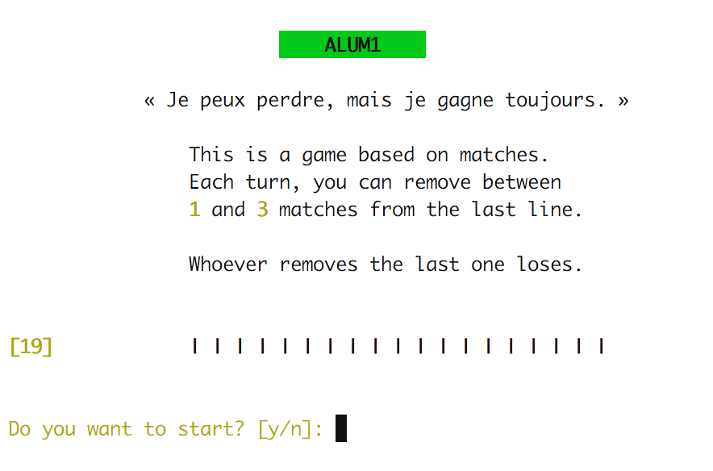
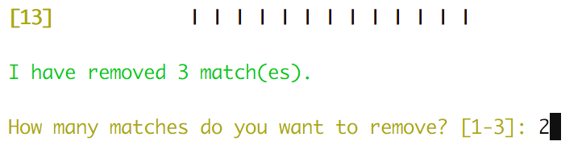
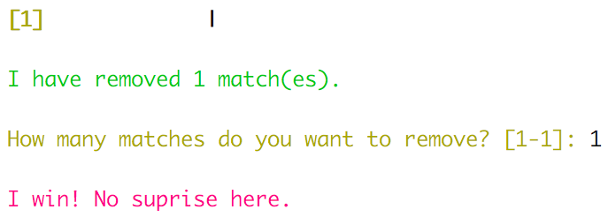

# Alum1 (AlCu) - An AI That Tries To Win A Nim Game

Subject: [alum1.en.pdf](alum1.en.pdf)

This project had to be done in 48 hours and the goal was to code an AI that can
play a [Nim game](https://en.wikipedia.org/wiki/Nim) with matches based on the
one featured in [Last Year at
Marienbad](https://en.wikipedia.org/wiki/Last_Year_at_Marienbad). The AI had to
try to win. In practice our AI would always win if the initial conditions were
right (number of matches and first player).

Please keep in mind that this project was done in a group, so obviously part of
the code or ideas may not be not mine.

## Setup

Build:

```sh
make
```

## Usage

```
./alum1
{NUMBER OF MATCHES}
```

## Screenshots

### Home Screen



### Game Screen



### End Screen


