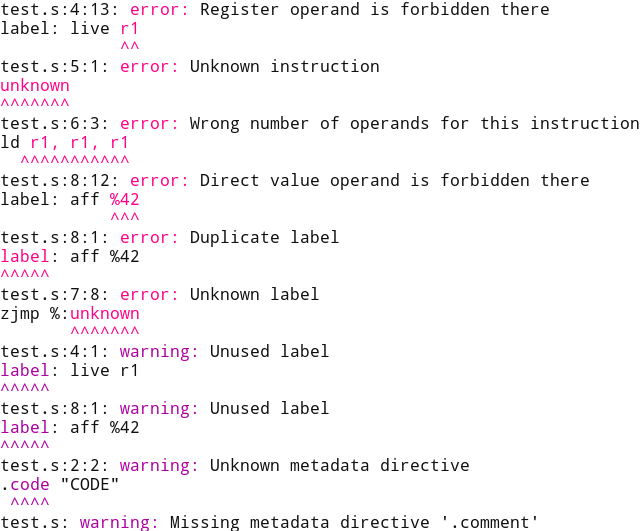
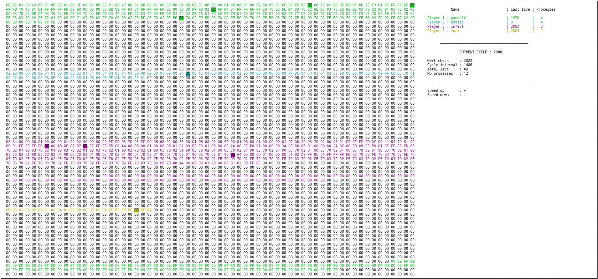

# Corewar - Make Programs Fight for Their Lives

Subject: [corewar.en.pdf](corewar.en.pdf)

For this project we had to develop a virtual machine where programs fight, an
assembler that compiles the programs, and some example programs.

I wrote the assembler, the core library and the binary and source file formats
specifications with
[ABNF](https://en.wikipedia.org/wiki/Augmented_Backus%E2%80%93Naur_form). I also
designed large parts of the project architecture.

We used my [custom test
framework](https://github.com/jody-frankowski/42/tree/master/libunit) for the
unit tests.

## Setup

Build:

```
make
```

## Usage

```
# Compile some programs
assembler/asm champion/bunker.s
assembler/asm champion/eraser.s
# Make the two programs fight in the vm with the ncurses interface
vm/corewar -v champion/bunker.cor champion/eraser.cor
```

## Assembler Example

```
$ cat test.s
.name "NAME"
.code "CODE"

label: live r1
unknown
ld r1, r1, r1
zjmp %:unknown
label: aff %42
```

```
assembler/asm test.s
```



## VM Example



## Project Structure

What this repository contains:

- `assembler/`: Code for the assembler binary
- `champion/`: Code for the champion
- `lib/libasm/`: Code for the libasm that is used by `assembler` and `vm`
- `lib/libft/`: Code for the libft
- `Makefile`: Makefile that builds the `assembler`, the `champion` and the `vm` (TODO)
- `resources/`: Helping resources that were given with the subject
- `vm/`: Code for the corewar virtual machine

All the subprojects (`assembler`, `lib(asm|ft)`, and `vm`) use the following
structure:

- `project/build/`: Build directory
- `project/include/`: Header files (`*.h`)
- `project/integration-tests/`: High-level "integration" tests that usually are
   scripts
- `project/lib/`: Symlinks or directories that contain libraries the project
  depends on
- `project/Makefile`: The Makefile that will build the project. The following
  two configurations need to be done:
  - The used library is specified as follows `DEPENDENCIES = libasm libft`
  - The resulting binary and/or static library is specified as follows
    `NAME = corewar` and/or `LIBNAME = libvm.a`. Also check the documentation in
	`common.mk`.
- `project/src/`: Source files (`*.c`)
- `project/test/`: A subproject with the same structure that contains the tests
  for this project

## Comments Format

As much as possible, functions, enums and structs should be commented with the
same format as the one [the Linux kernel
uses](https://www.kernel.org/doc/Documentation/kernel-doc-nano-HOWTO.txt).

## Commits Message Format

The following convention should be used:
[https://www.conventionalcommits.org/en/v1.0.0/](https://www.conventionalcommits.org/en/v1.0.0/).
A "scope" (in `fix(libasm)` `fix` is the type and `libasm` is the scope) SHOULD
always be used.

### Specifications

The following specifications are written in ABNF, see [this Wikipedia
article](https://en.wikipedia.org/wiki/Augmented_Backus%E2%80%93Naur_form) for
more details.

#### Assembly Format Specification

```abnf
LOALPHA = %x61-7A ; a-z
DIGIT   = %x30-39 ; 0-9
LF      = %x0A    ; \n
OCTET   = %x00-FF ; 8 bits of data

HTAB = %x09    ; horizontal tab
SP   = %x20    ; space
WSP  = HTAB/SP ; whitespace

assembly = *empty-directive
           (name-directive *empty-directive comment-directive)
           / (comment-directive *empty-directive name-directive)
           ;; The provided asm binary doesn't support having no instructions.
           ;; We will.
           *(empty-directive / instruction-directive)

name-directive    = *WSP ".name"    *WSP %x22 0*128quoted-char  %x22 *WSP [comment] LF ; '.name[ \t]*"[^"\n]{0,128}"'
comment-directive = *WSP ".comment" *WSP %x22 0*2048quoted-char %x22 *WSP [comment] LF ; '.comment[ \t]*"[^"\n]{0,2048}"'
empty-directive   = *WSP [comment] LF
quoted-char = %x01-09 / %x0B-21 / %x23-FF ; [^\x00\n"]
comment     = ("#" | ";") *(%x01-09 / %x0B-FF) ; (#|;)[^\x00\n]*

instruction-directive = *WSP
                        (label / instruction / (label *WSP instruction))
                        *WSP [comment] LF

instruction = instruction-name *WSP operands

label           = label-text label-delimiter
label-text      = 1* label-char
label-char      = 1* (LOALPHA | DIGIT | "_")
label-delimiter = ":"
label-reference = label-delimiter label-text

instruction-name = "add" / "aff" / "and" / "fork" / "ld" / "ldi" / "lfork"
                   / "live" / "lld" / "lldi" / "or" / "st" / "sti" / "sub"
                   / "xor" / "zjmp"

operands = operand *2(*WSP operand-separator *WSP operand)
operand-separator = ","
operand = operand-register / operand-direct / operand-indirect
operand-register  = <"r" followed by a number between 1 and 16>
operand-direct    = direct-delimiter (direct-value / label-reference)
operand-indirect  = direct-value / label-reference
direct-delimiter  = "%"
direct-value      = decimal-value
decimal-value     = <a 32-bit value in ascii in decimal>
```

#### Binary Format Specification

```abnf
binary = header 0*instruction

header = magic-number program-name 3padding-byte program-size program-comment 3padding-byte

magic-number = %x00ea83f3

program-name = 128program-name-chars %x00
program-name-chars = %x00-09 / %x0B-21 / %x23-FF ; \"[^\"\n]*\"

program-size = <4 OCTET in big endian order>

program-comment = 2048program-comment-chars %x00
program-comment-chars = %x00-09 / %x0B-21 / %x23-FF ; \"[^\"\n]*\"

padding-byte = %x00

instruction = opcode 0*1argument-coding-byte 1*3operand

opcode = %b00000001-%b00010000

argument-coding-byte = 3(register-acb / direct-acb / indirect-acb) %b00
register-acb = %b01
direct-acb   = %b10
indirect-acb = %b11

operand = operand-register / operand-direct / operand-indirect
operand-register = OCTET
operand-direct   = <4 OCTET in big endian order>
operand-indirect = <2 OCTET in big endian order>
```

## Instructions

DIR = Direct Value
IND = Indirect Value
REG = Register

| Opcode   | Mnemonic | Number of Arguments | Argument 1 Types | Argument 2 Types | Argument 3 Types | Has ACB | Modifies Carry | Direct Value is on X Bytes | Number of Cycles |
| -------- | -------- | ------------------- | ---------------- | ---------------- | ---------------- | ------- | -------------- | -------------------------- | ---------------- |
| 0x01     | live     | 1                   | DIR              |                  |                  | No      | No             | 4                          | 10               |
| 0x02     | ld       | 2                   | DIR IND          | REG              |                  | Yes     | Yes            | 4                          | 5                |
| 0x03     | st       | 2                   | REG              | IND REG          |                  | Yes     | No             |                            | 5                |
| 0x04     | add      | 3                   | REG              | REG              | REG              | Yes     | Yes            |                            | 10               |
| 0x05     | sub      | 3                   | REG              | REG              | REG              | Yes     | Yes            |                            | 10               |
| 0x06     | and      | 3                   | DIR IND REG      | DIR IND REG      | REG              | Yes     | Yes            | 4                          | 6                |
| 0x07     | or       | 3                   | DIR IND REG      | DIR IND REG      | REG              | Yes     | Yes            | 4                          | 6                |
| 0x08     | xor      | 3                   | DIR IND REG      | DIR IND REG      | REG              | Yes     | Yes            | 4                          | 6                |
| 0x09     | zjmp     | 1                   | DIR              |                  |                  | No      | No             | 2                          | 20               |
| 0x0A     | ldi      | 3                   | DIR IND REG      | DIR REG          | REG              | Yes     | No             | 2                          | 25               |
| 0x0B     | sti      | 3                   | REG              | DIR IND REG      | DIR REG          | Yes     | No             | 2                          | 25               |
| 0x0C     | fork     | 1                   | DIR              |                  |                  | No      | No             | 2                          | 800              |
| 0x0D     | lld      | 2                   | DIR IND          | REG              |                  | Yes     | Yes            | 4                          | 10               |
| 0x0E     | lldi     | 3                   | DIR IND REG      | DIR REG          | REG              | Yes     | Yes            | 2                          | 50               |
| 0x0F     | lfork    | 1                   | DIR              |                  |                  | No      | No             | 2                          | 1000             |
| 0x10     | aff      | 1                   | REG              |                  |                  | Yes     | No             |                            | 2                |

### Descriptions

IDX_MOD = 512
PC = Program Counter

Except where noted all the addresses are relative to the PC and are modulo
IDX_MOD.

- `live`: Notifies the VM that the process is alive, and with a direct value
  (first arg) that the player whose number is the same is alive
- `ld`: Load a direct or indirect value (first arg) into a register (second
  arg). Modifies the carry.
- `st`: Store the value of a register (first arg) in memory @ `PC + VAL %
  IDX_MOD` where VAL is an indirect or register value (second arg)
- `add`: Add a register (first arg) to another (second arg) and store the result
  in a register (third arg). Modifies the carry.
- `sub`: Subtract a register (first arg) from another (second arg) and store the
  result in a register (third arg). Modifies the carry.
- `and`: Do a binary AND between two direct, indirect or register values (first
  and second arg) and store the result in a register (third arg). Sets the carry
  to 1 if the result is 0.
- `or`: Do a binary OR between two direct, indirect or register values (first
  and second arg) and store the result in a register (third arg). Modifies the carry
- `xor`: Do a binary XOR between two direct, indirect or register values (first
  and second arg) and store the result in a register (third arg). Modifies the carry.
- `zjmp`: If the carry is 1, jump to an address specified as a direct value
  (first arg)
- `ldi`: Load a value from memory @ `PC + (VAL1 + VAL2) % IDX_MOD` where VAL1 is
  a direct, indirect or register value (first arg) and VAL2 is a direct or
  register value (second arg), into a register (third value)
- `sti`: Store the value of a register (first arg) in memory @ `PC + (VAL1 +
  VAL2) % IDX_MOD` where VAL1 is a direct, indirect or register value (second
  arg) and VAL2 is a direct or register value (third arg)
- `fork`: Create a new child process that will inherit the register values of
  its parent and whose PC will be `PC + VAL % IDX_MOD` where VAL is a direct
  value (first arg)
- `lld`: Load a value from memory @ `PC + VAL` where VAL is a direct or indirect
  value (first arg), into a register (second arg) without the modulo IDX_MOD
  restriction. Modifies the carry.
- `lldi`: Load a value from memory @ `PC + (VAL1 + VAL2)` where VAL1 is a direct,
  indirect or register value (first arg) and VAL2 is a direct or register value
  (second arg), into a register (third value). Modifies the carry.
- `lfork`: Create a new child process that will inherit the register values of
  its parent and whose PC will be `PC + VAL` where VAL is a direct value (first
  arg)
- `aff`: Print a register value (first arg) modulo 256 interpreted as an
  ASCII character on the standard output

### Examples

```
                      op  acb arg1         arg2         arg3
live  %42:            01      00 00 00 2a
ld    %42, r1:        02  90  00 00 00 2a  01
st    r1,  r2:        03  50  01           02
add   r1,  r2,  r3:   04  54  01           02           03
sub   r1,  r2,  r3:   05  54  01           02           03
and   %42, %42, r1:   06  a4  00 00 00 2a  00 00 00 2a  01
or    %42, %42, r1:   07  a4  00 00 00 2a  00 00 00 2a  01
xor   %42, %42, r1:   08  a4  00 00 00 2a  00 00 00 2a  01
zjmp  %42:            09      00 2a
ldi   %42, %42, r1:   0a  a4  00 2a        00 2a        01
sti   r1,  %42, %42:  0b  68  01           00 2a        00 2a
fork  %42:            0c      00 2a
lld   %42, r1:        0d  90  00 00 00 2a  01
lldi  %42, %42, r1:   0e  a4  00 2a        00 2a        01
lfork %42:            0f      00 2a
aff   r1:             10  40  01
```

## Notes

Notes:
- `.code` and `.extend` directives aren't supported by the official vm
- Direct values in hexadecimal aren't supported by the official vm
- Arithmetic in operands isn't supported by the official vm
