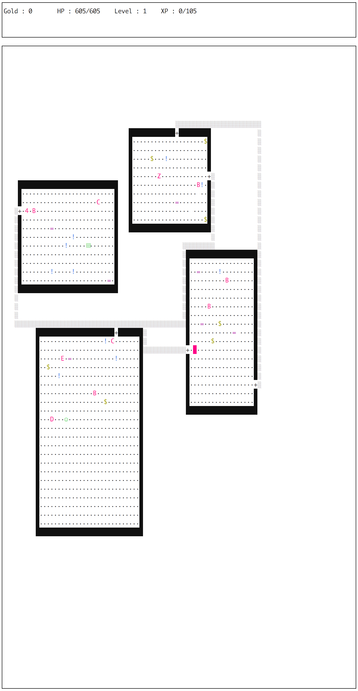
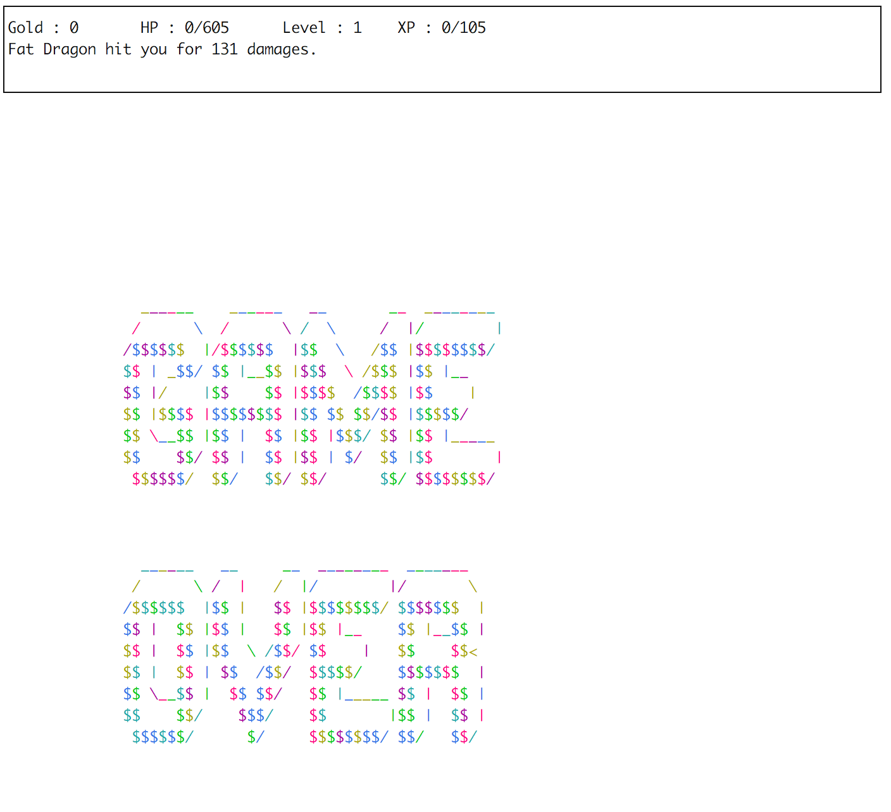

# minirogue - A Rogue Game in Python

Subject: [ft\_minirogue.pdf](ft\_minirogue.pdf)

This project had to be done in 48 hours and the goal was to implement a [rogue
game](https://en.wikipedia.org/wiki/Rogue_%28video_game%29) in Python 3. We dit
it in a object-oriented way.

We were allowed to use ncurses for the display.

Please keep in mind that this project was done in a group, so obviously part of
the code or ideas may not be not mine.

## Usage

```sh
./main.py
```

## Screenshots

### Start Screen



### Game Over Screen


