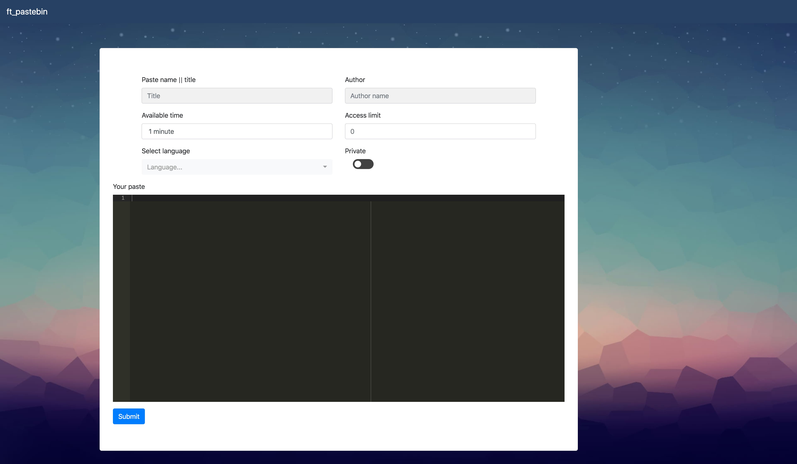
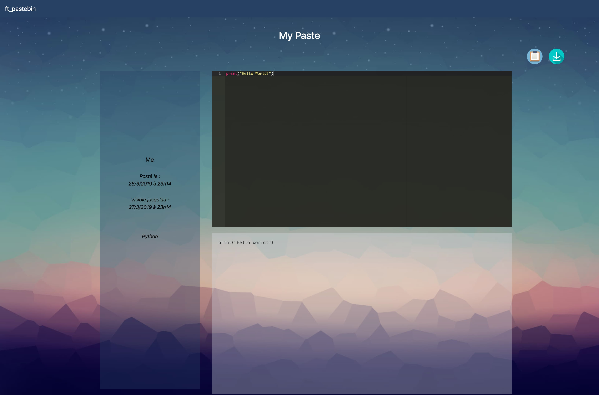
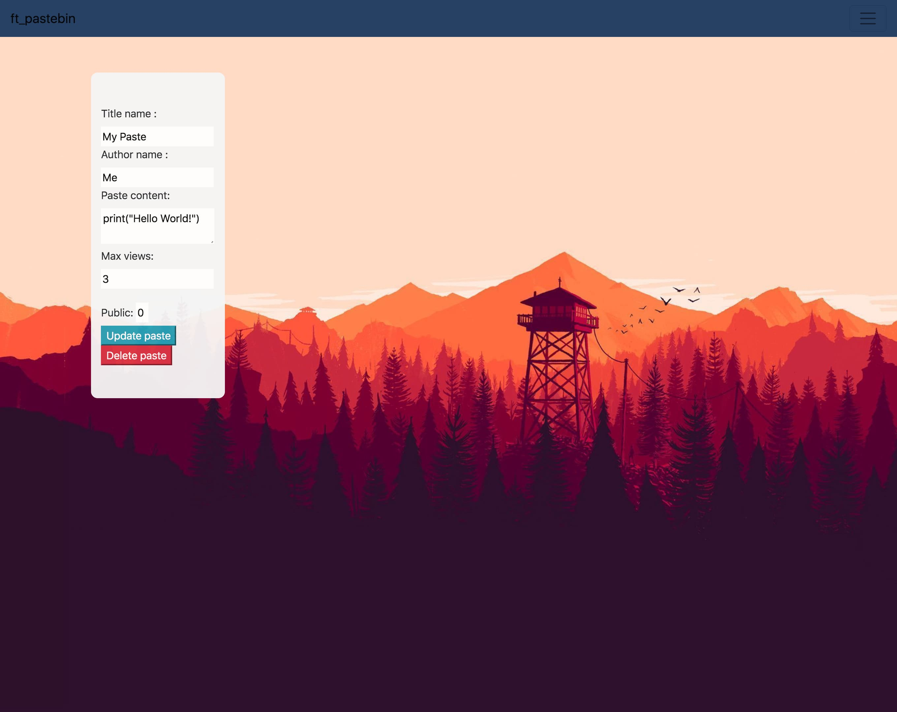

# pastebin - A Pastebin Website in JS

Subject: [ft\_pastebin.fr.pdf](ft_pastebin.fr.pdf)

This project had to be done in 48 hours and the goal was to implement a pastebin
website.

I managed to quickly create a POC backend in JS with
[Express](https://expressjs.com/) and a simple sqlite database so we sticked to
JS (instead of PHP). Later I switched to [Koa](https://koajs.com/) because it
had a "proper" async api ([app.js](app.js)).

This was the first time I worked with the async concept or an async api, so
don't be afraid to see a lot of `await`.

I made the backend by myself and the rest of the group did the front.

Please keep in mind that this project was done in a group, so obviously part of
the code or ideas may not be not mine.

## Setup

```sh
npm install
node app.js
```

Open the client [localhost:3000](localhost:3000) and the admin
[localhost:4242](localhost:4242) (admin:admin).

## Screenshots

### Homepage



### Paste



### Admin


